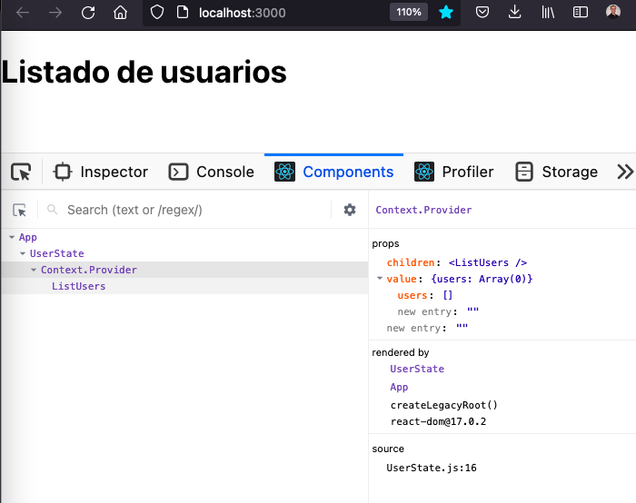
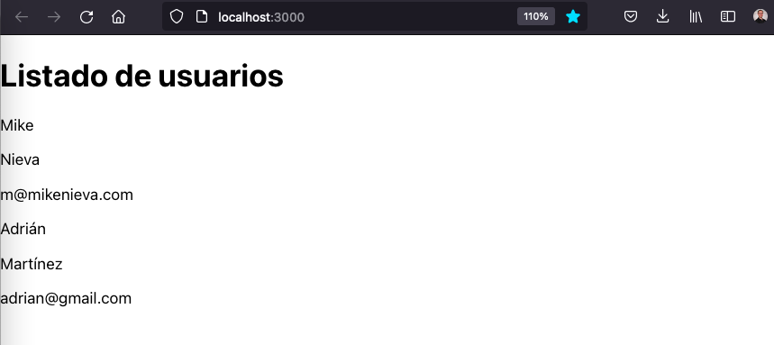
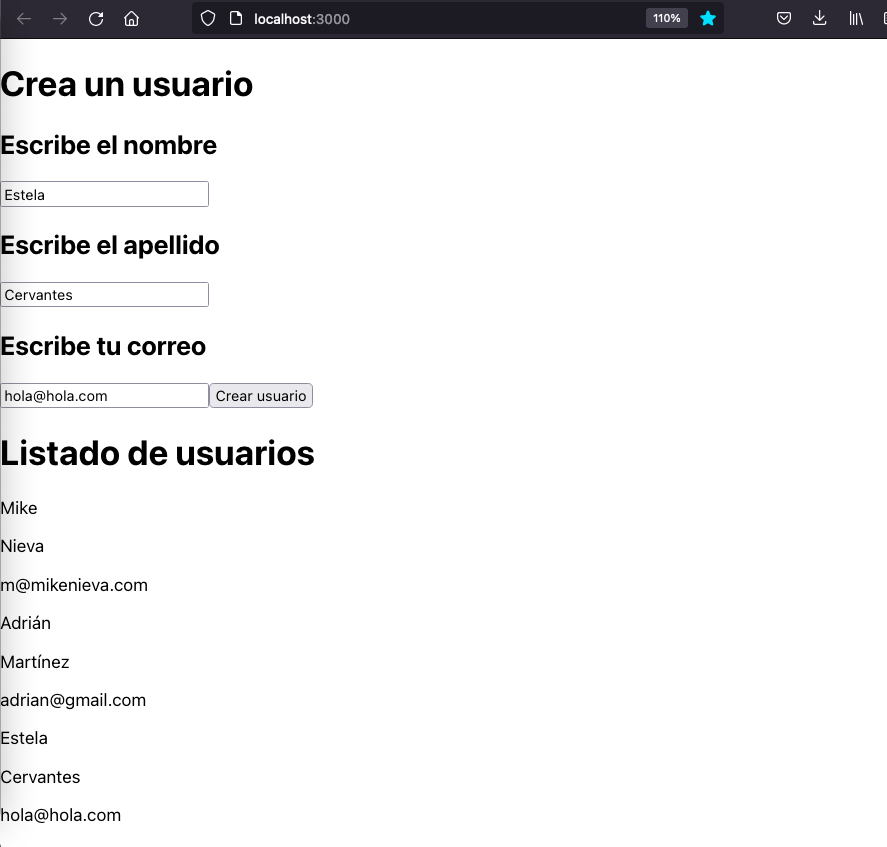

# Crea y consume elementos en React combinando `useState`, useContext y `useReducer`

## Introducción

Cuando desarrollamos bajo la librería de React, detectamos la importancia de fluir eficientemente nuestros datos internos generados desde los componentes y externos que llegan a nuestra aplicación, usualmente desde una API.  

Dependiendo de la situación, aplicamos un Hook específico para esta gestión.

Dentro de este artículo, haremos una combinación de esta gestión:

- `useState` para un manejo interno de datos en un componente o, 
- `useReducer` combinado con `useContext` para involucrar un estado global sin tener que trasladar datos con `props`.

# Objetivo

Crearás un sistema de operación CRUD involucrando un flujo de datos eficiente a través de `useState`, `useContext` y `useReducer`, incluyendo la comunicación a través de un API.

# Outline

## ¿A quién está dirigido este artículo?

Está dirigido a personas que han aprendido React en un nivel básico y quieren empezar a utilizar de una manera más extensa las funcionalidades en el manejo de datos.

## ¿Qué encontrarás en este articulo?

- Preparación de nuestro ambiente básico en React con `react-router-dom`.

- Generaremos un servidor sencillo con `json-server`.

- Establecer una sección para realizar creación y edición de usuarios. Asimismo, una más para observar una lista de los mismos.

## Lo que vas a aprender

Al terminar este artículo, serás capaz de:

- Aplicar tres hooks de React, permitiéndote fluir datos por toda la aplicación.

- Extraer los datos externos desde una API externa, con React.

## Preparación de ambiente

Crea una aplicación con React.

```shell
$ mkdir react-exercise
$ cd react-exercise
$ npx create-react-app .
```

Posteriormente, necesitaremos instalar dos dependencias:

```shell
npm install axios 
npm install -g json-server
```

`axios` será utilizado para el consumo de datos y `json-server` para la creación de un servidor local con `fake data`, que podremos usar a través de un puerto específico.

Ahora bien, trabajemos directamente con el directorio. Generaremos estos documentos y archivos. Quitaremos algunos archivos también.

Te debe quedar de esta forma:

```
|- node_modules/
|- public/
|- src/
    |- components/
        |- FormUser.js
        |- ListUsers.js
    |- config/
        |- axios.js
    |- context/
        |- UserContext.js
        |- UserReducer.js
        |- UserState.js
    |- App.js
    |- index.css
    |- index.js
|- .env
|- .gitignore
|- db.json
|- package-lock.json
|- package.json
|- README.md
```

Dentro de estos archivos, consideramos:

- Una carpeta `components`, que se incluyen 3 archivos. En estos, trabajaremos el desarrollo de la aplicación y consumo de datos.

- Una carpeta `config`el cual incluye un `axios.js`. Aquí, al momento de comunicarnos a través del API, estableceremos la configuración específica para nuestras llamadas.

- Una carpeta `context`, en el cual, a través de la misma, estructuraremos nuestro **"Context"**. Asimismo, desarrollaremos un `UserReducer` que contará con la gestión del estado global (`UserState`), para ser transferido a los componentes a través del contexto.

Finalmente, unos archivos nuevos encontrados fuera de la carpeta `src`.      

- `db.json`. Un archivo con el cual, a través de la dependencia de `json-server`, simularemos la transacción de una base de datos simple.

Insertamos ahí mismo:

`db.json`

```json
{
  "users": [
    {
      "id": 1,
      "first_name": "Mike",
      "last_name": "Nieva",
      "email": "m@mikenieva.com"
    },
    {
      "id": 2,
      "first_name": "Adrián",
      "last_name": "Martínez",
      "email": "adrian@gmail.com"
    }
  ]
}
```

- `.env`. Nuestras variables de entorno. Establecemos dentro:

```
REACT_APP_BACKEND_URL="http://localhost:3004"
```

Listo. Levantamos nuestra aplicación a través de dos terminales separadas. El primero alzará `React`, el segundo nuestro servidor local.

```shell
$ npm run start
```

```shell
$ json-server db.json --port 3004
```

Comencemos a desarrollar.

## Desarrollo de `Context`

Primero, establecemos nuestra `App.js` con esta configuración.

```javascript

import './App.css'
import ListUsers from './components/ListUsers'

function App() {
  return (
    <>
        <ListUsers />     
    </>
  );
}

export default App;

```

Después, accedemos a `ListUsers.js`. Dejamos muy sencilla la aplicación por ahora para no obtener errores.

```javascript
import React, { useEffect, useContext } from 'react'

export default function ListUsers() {

    // 1. GESTIÓN DE CONTEXTO

    // 2. LLAMADA ASÍNCRONA CON USEEFFECT

    // 3. RETORNO
    return (
        <div>
            <h1>Listado de usuarios</h1>
        </div>
    )
}
```

Bien. Con esto listo, vamos a proceder a desarrollar nuestro contexto y estado global.

> `React Context` es un método que permite transferir `props` de un componente padre a sus hijos, a través del almacenamiento de datos en un `store`, sin realizarlo de manera manual, por nivel. En una explicación más general, cualquier componente hijo puede acceder a estos valores mientras esté situado debajo del componente padre.

Accedemos a `UserContext.js` y preparamos nuestro `Context`.

```javascript
import { createContext } from 'react'

const UserContext = createContext()

export default UserContext
```

Ahora, accedemos a `UserState.js` y dentro, preparamos nuestro estado inicial, transferido a través de un `Provider` en nuestro `Context`.

```javascript

import { useReducer } from 'react'
import UserContext from './UserContext'

const UserState = (props) => {

    const initialState = {
        users: []
    }

    return (
        <UserContext.Provider
            value={{
                users: initialState.users
            }}
        >
            {props.children}
        </UserContext.Provider>
    )

}

export default UserState

```

Bien. Ahora accedemos a `App.js` y anclamos `UserState` como el componente padre hacia el resto de la aplicación.

```javascript

import './App.css';
import ListUsers from './components/ListUsers'

import UserState from './context/UserState'; // ⬅️

function App() {
  return (
    <>
      <UserState>
        <FormUser />  /* ⬅️ */
        <ListUsers />     
      </UserState>
    </>
  );
}

export default App;
```

El resultado será nuestra página con el valor del contexto ya disponible para los componentes.



> En caso de que no lo tengas instalado, utilizo `React Developer Tools` para el navegador de Firefox. Aunque, también está disponible para Google Chrome.

Excelente. Ahora, hagamos un último ajuste dentro de `ListUsers.js` para bajar los datos desde el contexto.

```javascript
import React, { useEffect, useContext } from 'react'
import UserContext from '../context/UserContext'

export default function ListUsers() {

    const ctx = useContext(UserContext)  // ⬅️
    const { users } = ctx // ⬅️

    return ( // ⬅️
        <div>
            <h1>Listado de usuarios</h1>

            {
                users.map((e) => {
                    return (
                        <div key={e.id}>
                            <p>{e.first_name}</p>
                            <p>{e.last_name}</p>
                            <p>{e.email}</p>
                        </div>
                    )
                })
            }            
        </div>
    )

}


```

Entre estos últimos cambios, destacamos:

- El uso de `useContext` para consumir el estado directamente en el componente.

- Realizamos una desestructuración de objetos con el valor de `users`, el cual es un arreglo vacío.

Una vez establecido esto, ahora trabajemos nuestro estado global y usemos el concepto de `reducer` para gestionarlo.

## Lectura de usuarios y flujo hacia componentes

En esta sección, nos conectaremos a nuestro servidor local a través `axios`, obtendremos los usuarios y los guardamos en nuestro estado global (`globalState`). Finalmente, fluiremos los datos al componente para su consumo y muestra.

Comencemos configurando el archivo que creamos llamado `axios.js`, el cual establecerá a través de la variable de entorno que creamos anteriormente, la URL base para las llamadas API.

```javascript
import axios from 'axios'

const clientAxios = axios.create({
    baseURL: process.env.REACT_APP_BACKEND_URL
})

export default clientAxios
```

Listo. Accedamos a nuestro `UserState.js` y agregamos:

```javascript

import { useReducer } from 'react' // ⬅️

import UserContext from './UserContext'
import UserReducer from './UserReducer' // ⬅️
import clientAxios from './../config/axios' // ⬅️


const UserState = (props) => {

    const initialState = {
        users: []
    }

    const [globalState, dispatch] = useReducer(UserReducer, initialState) // ⬅️

    const readUsers = async () => { // ⬅️

        try {
            const res = await clientAxios.get("/users")

            dispatch({
                type: "READ_USERS",
                payload: res.data
            })

        } catch (error) {
            console.log(error)
        }

    }

    return (
        <UserContext.Provider
            value={{
                users: globalState.users,
                readUsers   // ⬅️
            }}
        >
            {props.children}
        </UserContext.Provider>
    )

}

export default UserState


```

Considera varios puntos aquí:

- Hacemos la importación de nuestro `UserReducer.js` (aún no trabajamos) y el archivo de `axios.js` a partir del nombre de `clientAxios`.

- Utilizamos el hook de `useReducer` para permitir la creación de un estado global, gestionado por una función llamada `reducer`, la cual a través de las acciones y el disparador `dispatch` permitirán su manipulación.

- Creamos una función llamada `readUsers`. Dentro, haremos una llamada con `axios` con el método GET y obtendremos los usuarios. Destacamos que es una función asíncrona, por lo tanto `async-await` son imprescindibles.

- Una vez obtenida la respuesta, en caso de que todo haya sucedido correctamente aplicamos `dispatch` donde le pasaremos como argumento un `action`, el cual es un objeto que contiene dos propiedades:
    - `type.` El nombre del tipo de acción que ejecutaremos en el `reducer`.
    - `payload.` Información que enviaremos al reducer, con el cual, manipularemos el estado global.

- Finalmente, en el retorno, añadimos `readUsers` al atributo de `value` para que pueda ser consumida por todos los componentes.

Bien. Ahora, hagamos el cambio en el `reducer:`


`UserReducer.js`

```javascript
const reducer = (globalState, action) => {

    switch (action.type) {

        case "READ_USERS":

            return {
                ...globalState,
                users: action.payload
            }
    
    }

}

export default reducer
```

El `reducer` es una función el cual recibe dos parámetros:

- `globalState.` El cual es el estado actual en el cual se encuentra nuestro estado. 

- `action.` Es el objeto que viene de nuestro `dispatch`, el cual comprende los dos valores que comentamos anteriormente, `type` y `payload`.

Observa con cuidado que realizamos un `switch` y este mismo, evalúa el `action.type` para identificar cómo vamos a manipular el estado global. Identificamos `READ_USERS` y entonces realizamos un retorno para hacer las modificaciones.

Con esto terminado, estamos listos para trabajar el componente. Vamos a `ListUsers.js`

```javascript
import React, { useEffect, useContext } from 'react'
import UserContext from '../context/UserContext'

export default function ListUsers() {

    const ctx = useContext(UserContext)
    const { users, readUsers } = ctx // ⬅️

    useEffect(() => { // ⬅️

        const getResponse = async () => {
            
            await readUsers()
            return 
        }

        getResponse()

    }, [])

    return (
        <div>
            <h1>Listado de usuarios</h1>
            {
                users.map((e) => {
                    return (
                        <p key={e.id}>{e.first_name}</p>
                    )
                })
            }            
        </div>
    )
}

```

El cambio principal realizado es a través de `useEffect`, el cual, de manera asíncrona y una vez que el componente ha sido cargado por primera vez, realiza la invocación de `getResponse`.

`getResponse` es obtenido a través del contexto y permite la obtención de los datos a través de la comunicación con nuestro servidor local.

Si todo sucedió correctamente, obtendremos esta resultado:



## Creación de usuarios y actualización de la lista en el componente

Como último paso, vamos a realizar la creación de usuarios a través del API.

Primero, anexamos el componente `FormUser.js` a nuestro `App.js`:

```javascript
import './App.css';

import FormUser from './components/FormUser'
import ListUsers from './components/ListUsers'

import UserState from './context/UserState';


function App() {
  return (
    <>
      <UserState>
        <FormUser />
        <ListUsers />     
      </UserState>
    </>
  );
}

export default App;

```


Hacemos un cambio en nuestro `UserState.js`:

```javascript

import { useReducer } from 'react'

import UserContext from './UserContext'
import UserReducer from './UserReducer'

import clientAxios from './../config/axios'

const UserState = (props) => {

    const initialState = {
        users: []
    }

    const [globalState, dispatch] = useReducer(UserReducer, initialState)

    const addUser = async (data) => {

        const { first_name, last_name, email } = data

        try {
            const res = await clientAxios.post("/users", { first_name, last_name, email })

            dispatch({
                type: "ADD_USER",
                payload: res.data
            })

        } catch (error) {
            console.log(error)
        }

    }

    const readUsers = async () => {

        try {
            const res = await clientAxios.get("/users")

            dispatch({
                type: "READ_USERS",
                payload: res.data
            })

        } catch (error) {
            console.log(error)
        }

    }

    return (
        <UserContext.Provider
            value={{
                users: globalState.users,
                addUser,
                readUsers
            }}
        >
            {props.children}
        </UserContext.Provider>
    )

}

export default UserState


```

Bien. Vayamos por partes.

- Generamos una nueva función llamada `addUser`. 
    - Ejecutamos como parámetro un valor `data` que contendrá los datos reales que vengan del formulario del componente. 
    - Realizamos una desestructuración de objetos de los valores que vienen del formulario.
    - Llamamos con un método POST y usando los datos disponibles del formulario, a nuestro servidor local para crear un nuevo usuario.
    - Realizado esto, ejecutamos un `dispatch` el cual realice un ajuste dentro de nuestro `reducer`.

- Esta función `addUser` la incorporamos dentro de nuestro retorno, en los atributos de `value`.

Entramos a `UserReducer.js` y hacemos el ajuste:

```javascript
const reducer = (globalState, action) => {

    switch (action.type) {

        case "READ_USERS":

            return {
                ...globalState,
                users: action.payload
            }
        
        case "ADD_USER":

            return {
                ...globalState,
                users: [...globalState.users, action.payload]
            }

    }

}

export default reducer

```

Para cerrar, entremos al componente de `FormUser.js`

```javascript
import React, { useState, useContext } from 'react'
import UserContext from '../context/UserContext'

export default function FormUser() {

    const ctx = useContext(UserContext)

    const { addUser } = ctx

    const [user, setUser] = useState({
        first_name: "",
        last_name: "",
        email: ""
    })


    const handleChange = (e) => {

        setUser({
            ...user,
            [e.target.name]: e.target.value
        })

    }

    const sendData = (e) => {
        e.preventDefault()
        addUser(user)
    }


    return (
        <div>
            <h1>Crea un usuario</h1>

            <form onSubmit={ (event) => { sendData(event) } }>
                <h2>Escribe el nombre</h2>
                <input 
                    name="first_name"
                    onChange={ event => { handleChange(event) }}
                />
                <h2>Escribe el apellido</h2>
                <input 
                    name="last_name"
                    onChange={ event => { handleChange(event) }}
                />

                <h2>Escribe tu correo</h2>
                <input 
                    name="email"
                    onChange={ event => { handleChange(event) }}
                />

                <button
                    type="submit"
                >
                    Crear usuario
                </button>

            </form>

        </div>
    )
}

```

Examinemos paso a paso este componente:


Nuestro resultado final, será este:



## Conclusiones


